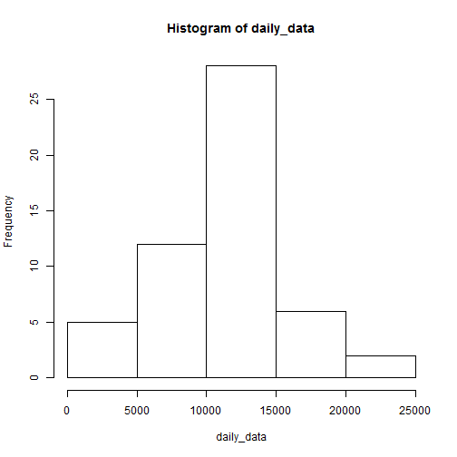
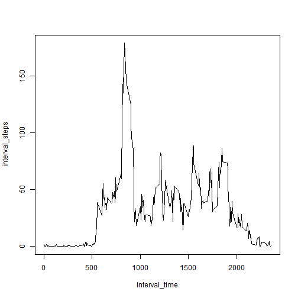
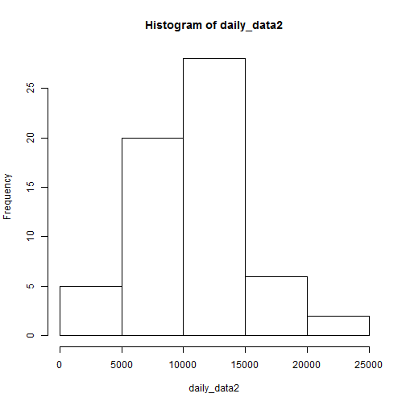
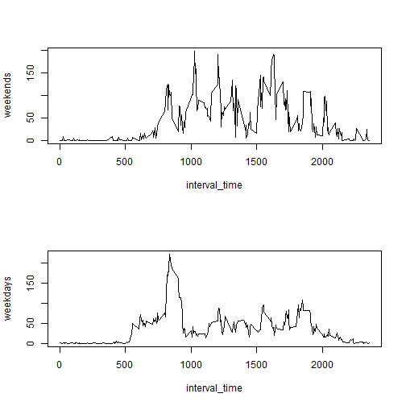

# Reproducible Research: Peer Assessment 1


## Loading and preprocessing the data

## What is mean total number of steps taken per day?

```r
data = read.csv("C:/Users/Rodrigo/Documents/Coursera/Reproducible Research/Project/activity.csv")
total_datas = length(data$interval)
datas_for_day = 24 * 60/5
total_days = total_datas/datas_for_day
i = 1
j = 1
N = total_days
M = datas_for_day
T = total_datas
daily_data = rep(0, times = N)
for (i in 1:N) {
    for (j in 1:M) {
        daily_data[i] = daily_data[i] + data$steps[(i - 1) * M + j]
    }
}
## png(filename='C:/Users/Rodrigo/Documents/Coursera/Reproducible
## Research/Project/hist.png', width = 480, height = 480)
hist(daily_data)
```

 

```r
## dev.off()

mean_steps = mean(daily_data, na.rm = TRUE)
median_steps = median(daily_data, na.rm = TRUE)

mean_steps
```

```
## [1] 10766
```

```r
median_steps
```

```
## [1] 10765
```


##mean = 10766.19, median = 10765


## What is the average daily activity pattern?

```r
interval_steps = rep(0, times = M)
i = 1
j = 1
for (i in 1:N) {
    for (j in 1:M) {
        if (is.na(data$steps[(i - 1) * M + j]) != 1) {
            interval_steps[j] = interval_steps[j] + data$steps[(i - 1) * M + 
                j]
        }
    }
}

interval_steps = interval_steps/N
interval_time = data$interval[1:M]

## png(filename='C:/Users/Rodrigo/Documents/Coursera/Reproducible
## Research/Project/daily_activiy_pattern.png', width = 480, height = 480)
plot(interval_time, interval_steps, type = "l")
```

 

```r
## dev.off()

interval_time[which.max(interval_steps)]
```

```
## [1] 835
```

```r
## 835 = 08:35 hrs max activity
```


## Imputing missing values

```r
NAcounts = length(which(is.na(data$steps)))
daily_fill = round(interval_steps)
row_na = which(is.na(data$steps))
i = 1
j = 1
k = 1
```


### for NAs, i replaced with daily mean values (previous exercise) 

```r
data2 = data
for (i in 1:T) {
    if (i == row_na[j]) {
        data2$steps[i] = daily_fill[k]
        j = j + 1
        k = k + 1
    }
    if (k == M + 1) {
        k = 1
    }
}
daily_data2 = rep(0, times = N)
for (i in 1:N) {
    for (j in 1:M) {
        daily_data2[i] = daily_data2[i] + data2$steps[(i - 1) * M + j]
    }
}

## png(filename='C:/Users/Rodrigo/Documents/Coursera/Reproducible
## Research/Project/hist2.png', width = 480, height = 480)
hist(daily_data2)
```

 

```r
## dev.off()

mean_steps2 = mean(daily_data2, na.rm = TRUE)
median_steps2 = median(daily_data2, na.rm = TRUE)

mean_change = (mean_steps2 - mean_steps)/mean_steps
median_change = (median_steps2 - median_steps)/median_steps

mean_change
```

```
## [1] -0.01723
```

```r
median_change
```

```
## [1] -0.03437
```


##mean_change = -1.722%, median_change = -3.437%

## Are there differences in activity patterns between weekdays and weekends?


```r
data_days = weekdays(as.Date(data$date))
weekends = rep(0, times = M)
weekdays = rep(0, times = M)
i = 1
j = 1
k = 1

count_weekend = 0
count_weekday = 0
for (i in 1:N) {
    for (j in 1:M) {
        if (is.na(data$steps[(i - 1) * M + j]) != 1) {
            if (data_days[(i - 1) * M + j] == "sábado" | data_days[(i - 1) * 
                M + j] == "domingo") {
                weekends[j] = weekends[j] + data$steps[(i - 1) * M + j]
                count_weekend = count_weekend + 1
            } else {
                weekdays[j] = weekdays[j] + data$steps[(i - 1) * M + j]
                count_weekday = count_weekday + 1
            }
        }
    }
}


wends = count_weekend/M
wdays = count_weekday/M

weekends = weekends/wends
weekdays = weekdays/wdays

# png(filename='C:/Users/Rodrigo/Documents/Coursera/Reproducible
# Research/Project/time_series_week.png', width = 480, height = 480)
layout(1:2)
plot(interval_time, weekends, type = "l")
plot(interval_time, weekdays, type = "l")
```

 

```r
# dev.off()
```

### In weekend steps are higher than in weekdays.


